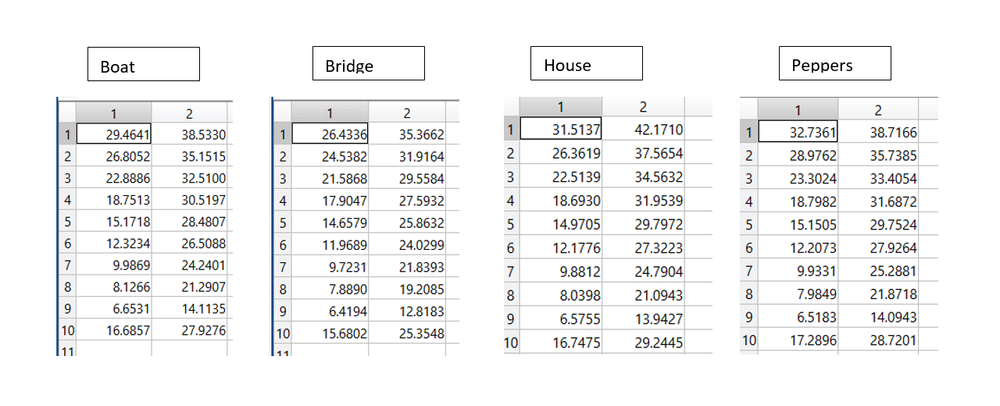

# Remove-Salt-and-Pepper-Noise-from-Images
Computer Vision Homework

## What is Salt and Pepper noise ?
Salt and pepper noise is an impulse type of noise in images. It is when a certain amount of the pixels in the image are either black or white (black or white dots). This noise is generally caused by errors in data transmission, failure in memory cell or analog-to-digital converter errors.

## Median Filtering
Median filtering is a common image enhancement technique for removing salt and pepper noise. Because this filtering is less sensitive than linear techniques to extreme changes in pixel values, it can remove salt and pepper noise without significantly reducing the sharpness of an image.

## Improved Median Filtering
This algorithm is executed only on noise pixels. It uses the median filter on each noise, with the difference that in each kernel, the noise pixels are removed again and the median is calculated on the remaining pixels and replaces the original pixel.

## PSNR
The PSNR computes the peak signal-to-noise ratio, in decibels, between two images. This ratio is used as a quality measurement between the original and a compressed image. The higher the PSNR, the better the quality of the compressed, or reconstructed image.

Here are the results for different percent of noise, from the first row being 10% to the last row being 100%. The first column is the results for using median filters and the second one is the improved one.

